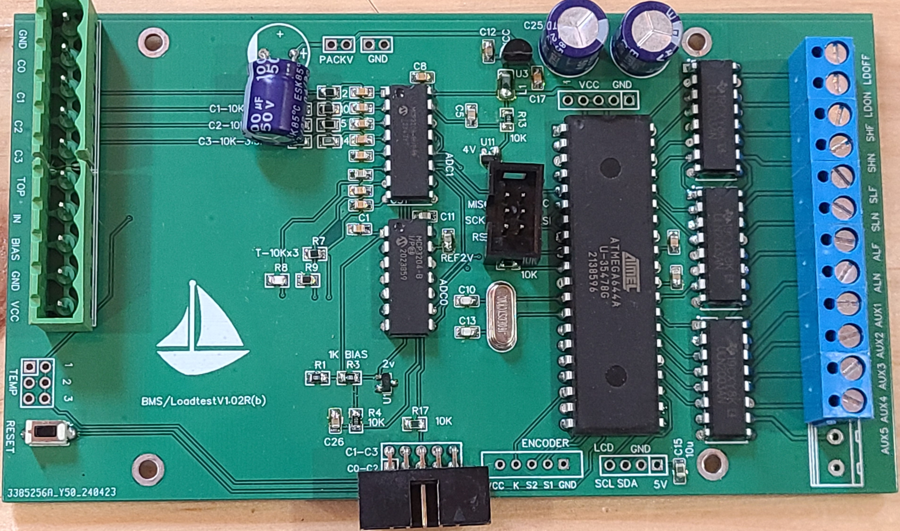
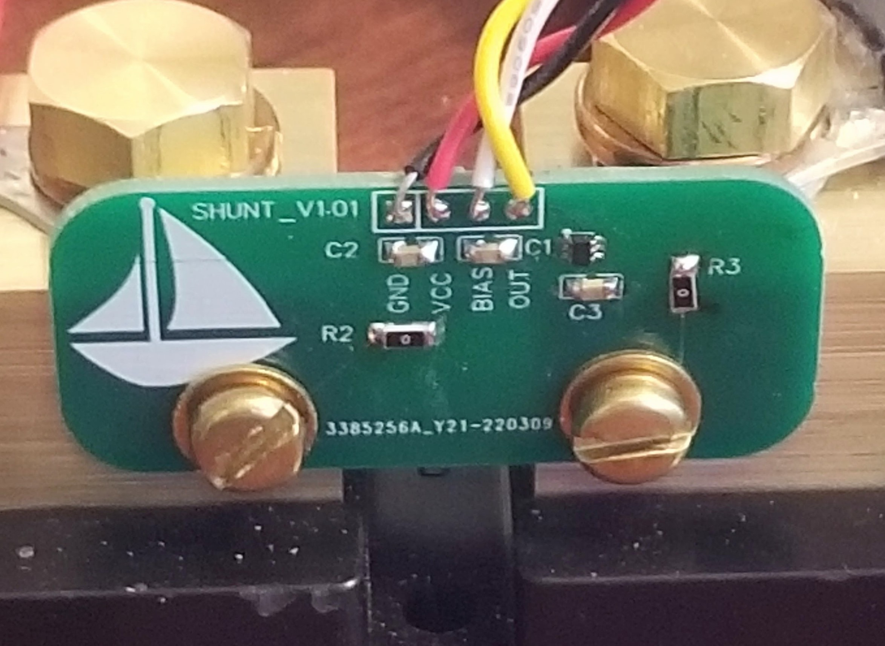
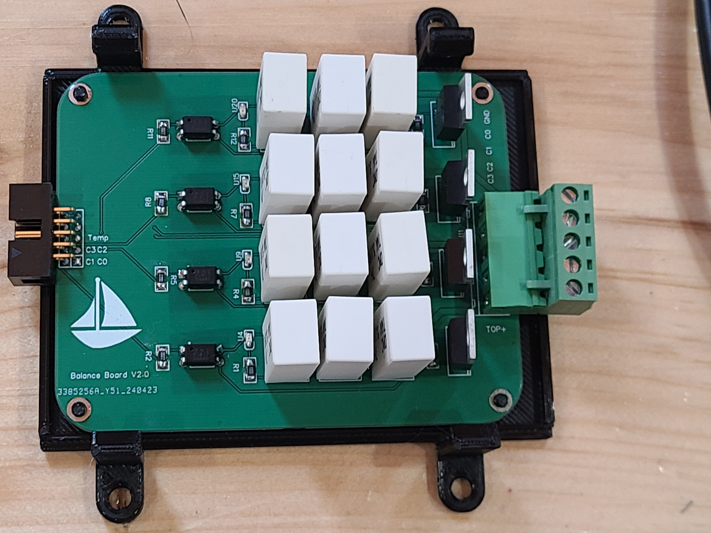

# Description & Purpose

Determinining lithium battery state of charge by cell voltage alone is too imprecise.  Impossible to determine health of pack by pack voltage.

I didn't like the idea of a drop in battery that might decide to disconnect or do a load dump when it wanted to.  (On a boat that means the worst possible moment)  I didn't want to add a start battery and the associated inefficiencies and complexity  When I started this project there wasn't much hardware available.  That's changed some but I still like this better.

# Credits
Stuart Pittaway

# Operation 
Cell voltage is determined by resistor voltage dividers and MCP3208 analog to digital converter.  
Accuracy better than +-5 mV.  Can be tuned for variations in resistor values.  Current is read by a 200A 50mV shunt output amplified by INA213 and read by MCP3204.  
40mA current draw, 80mA when LCD lit.

# Construction
Main board, Balance board, temperature sensor boards and current shunt board.  A combination of surface mount and through hole.  I assembled these with the printed stencil and a hot plate for the surface mount.
EasyEDA format schematic & board as well as gerbers for all.
3D print using PetG or similar.  PLA is too brittle.  Boards & LCD fit on printed pins, flatten pins with a soldering iron.  No screws needed.
3D printed stencil for main board (Thank you to https://solder-stencil.me/ )

Main board

Shunt board

Balance board

# hardware
Atmega 644 based.  

# Software
Compiled on Arduino IDE with MCUdude's excellent MightyCore

# BOM

# Installation
## Modifications to boat
Install latching relays to control AC input to shore charger, solar panel input to solar charger, ign signal to alternator relay.  Provision for latching relay to protect bank; I have a friend that uses this to shut off the fridge when the dock power goes out for long enough to drain the battery.  See [the overview](./Schematic_Typical-Layouts.pdf)

# Details

# Future Plans
Maybe add Bluetooth

## Parameter Menu Settings

Bank Capacity 
Total bank capacity in AmpHours.

Start Charge
When in Volt charge mode triggers start charge.  Constrained to a minimum of 60mV below StopCharge Voltage

Stop Charge
In either Volt or SOC charge mode triggers stop charge.  Constrained to a minimum of 50mV above StartCharge Voltage

SOC Start  
% charge to start charging when in SOC mode.

SOC Stop 
% charge to stop charging when in SOC mode.  Voltage also affects charge stop in SOC mode.

Charge Mode 
SOC or Voltage. In SOC mode, Charge will start if measured SOC falls below SOCstart parameter (Ignores Start Charge V )  and will stop when either SOC Stop or Stop Charge V is reached.  If Stop Charge V is set relatively low, charge will start again as voltage falls below the stop threshold and continue cycling until calculated SOC reaches a level above SOC Start.   SOC will NOT reach SOC stop in this scenario.

Charging starts when, depending on mode either SOC or voltage falls below start threshold.
Charging stops when depending on mode either voltage or SOC target is met or either temperature hi or low or voltage high (this is redundant) alarm is set.

When in VOL mode the 2nd row of the display shows current cell voltage on left and target voltage on right.  Up arrow for charging or ready charge and down arrow for not charging.  Target voltage is either start or stop voltage depending on whether charging or discharging.

When in SOC mode target SOC is on the left, current SOC on right.  Arrow indicates charge or discharge.  In both modes the up arrow indicates charge or charge ready and is not an indicator of actual charging status which is visible in the bottom left of the display.   

Chg To Full Now 
Starts charging as if the start parameter had been reached.  Charge continues until the stop parameter in current chargeMode is reached.

Efficiency 
% efficiency of charge.  No Peukert’s calculation as it’s assumed to be about 1 for LiFePo4.

HV Alarm
High Voltage Alarm. Sets alarm & stops charge.  Clears at -5mV.

LV Alarm 
Low Voltage Alarm. Sets alarm & allows charge.  Clears at +5mV

HV Disconnect
Assuming a bank protection relay boat & charging shut off until voltage falls below HVAlarm.  Will not stop the boat if PackVoltage < 15.6v.

LV Disconnect
Assuming a bank protection relay; boat & charging shut off until voltage rises above LVAlarm. 
Will not stop the boat if PackVoltage > 10.0v.

maxDrift
In millivolts.  If setting is reached an alarm will set but charging will continue.

C0Trim  C1Trim  C2Trim  C3Trim 
Enter in mV any offset required so the display matches actual cell voltages.  

Balance Allow V 
Voltage to start balance.  Highest cell is used.  Needs the optional balance board connected.  

Show Cells 
1st screen shows voltage of all cells, # of charge cycles since startup, cell drift in mV and # of times each cell has been balanced.  2nd screen shows system voltages, 3rd screen shows hi & lo cell, amperage, drift, pack & total voltage at end of last charge cycle.

Show Temps
Shows temp sensor readings battery & balance board

Show Alarms
Shows all saved previous alarms, key sensor readings at last alarm and alarm flags that were set at the time of last alarm.

Clear Alarm
Clears all active & inactive alarms.

Mode 
Choose BMS, OFF or DUM.  DUM turns on the boat and allows charging with no protection.  DUM mode display shows highest cell voltage and SOC.   Switching back to BMS restores full management.  OFF mode prevents charging. 

Encoder Direction
Changes direction of the encoder knob.  Used only for initial setup if required.  The change is immediate so twisting the knob in one direction changes the value 1-0-1-0-1-0 etc.

SOC
Set current SOC   This may be useful for initial install or testing.

Shunt Polarity 
Allows connecting shunt in either direction.  Use if A display reversed.

Number of Temp Sense
Choose correct # of battery temp sensors used
